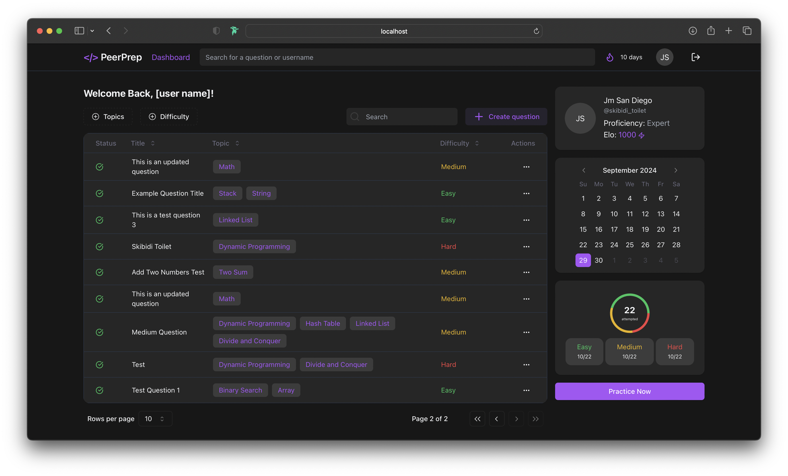

# PeerPrep-G33 (Frontend)



## Nextjs 14 Application

### Quick Start

1. In the project directory, create a copy of the `.env.example` file and name it `.env`.
2. Update the `.env` file with any required environment variables (e.g., API keys, database connection strings, etc.).
3. Ensure you are in the ./frontend directory, then install the project dependencies with:

```bash
npm install

npm run dev

ready - navigate to http://localhost:3000 to view the project
```
